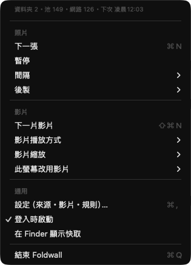
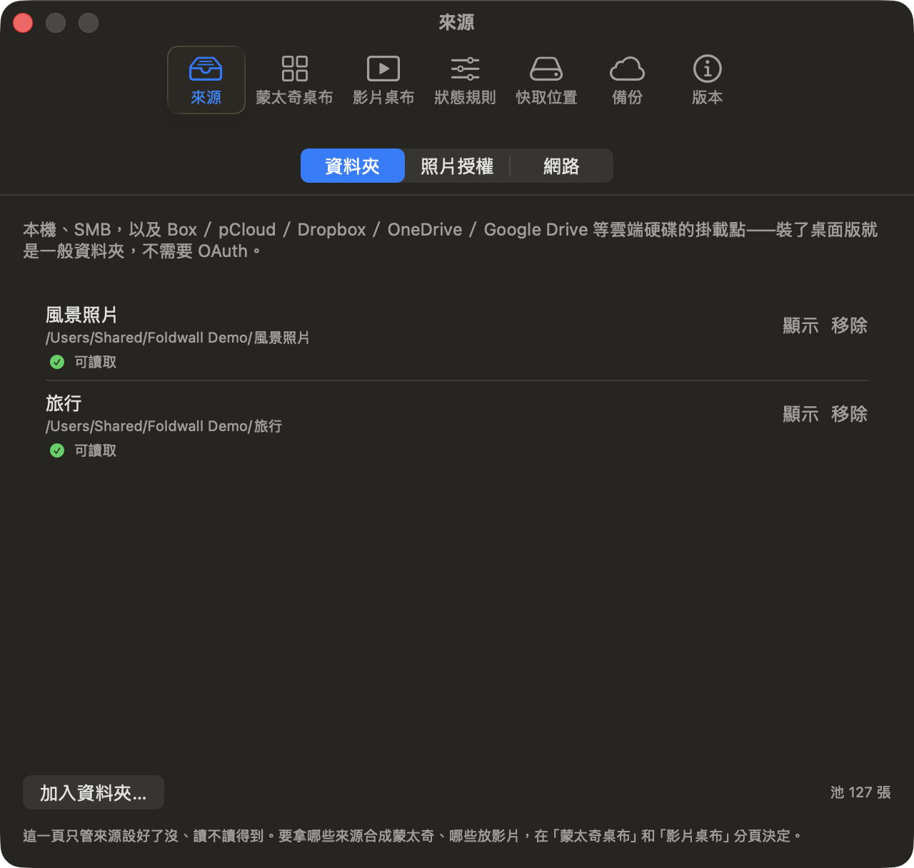
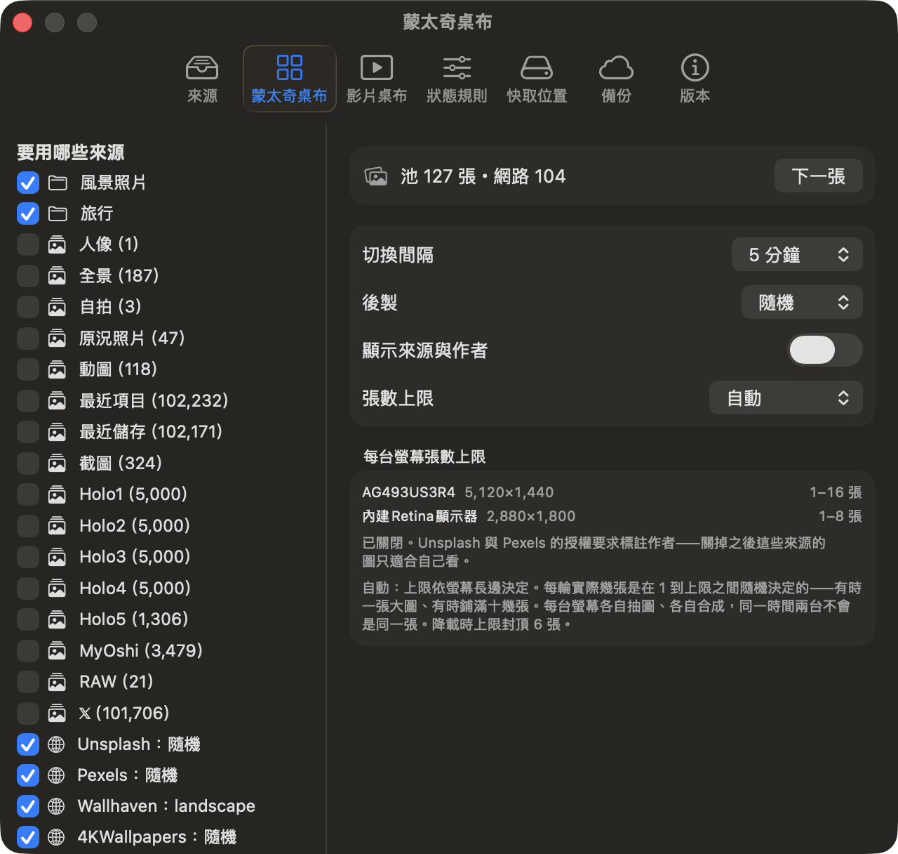
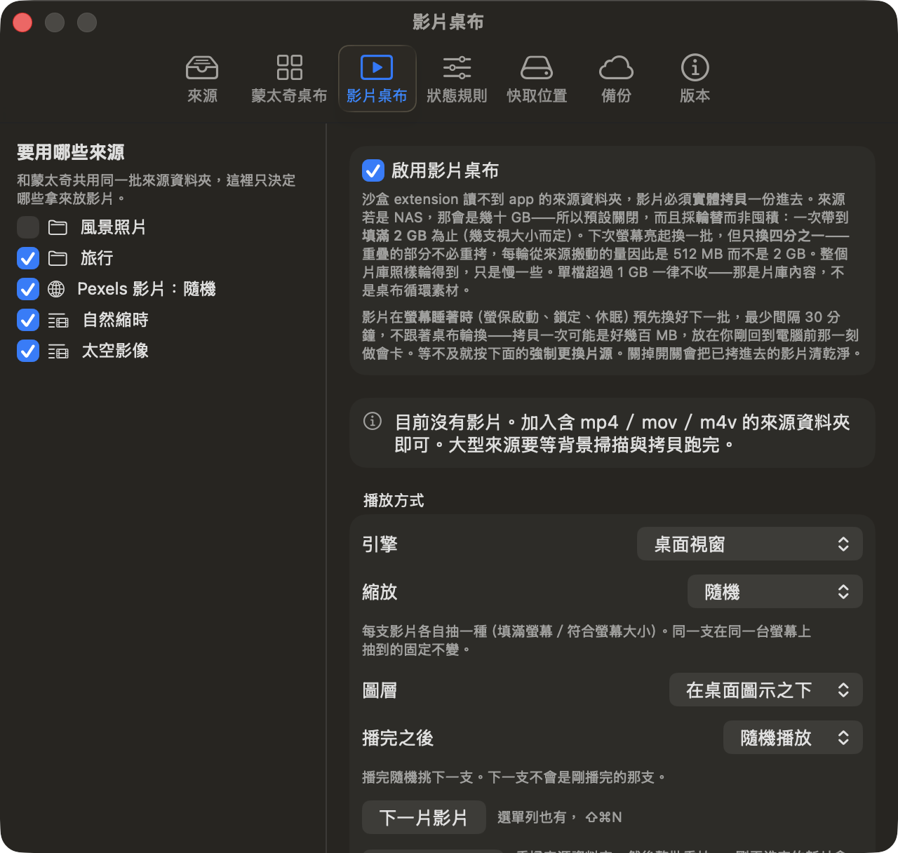
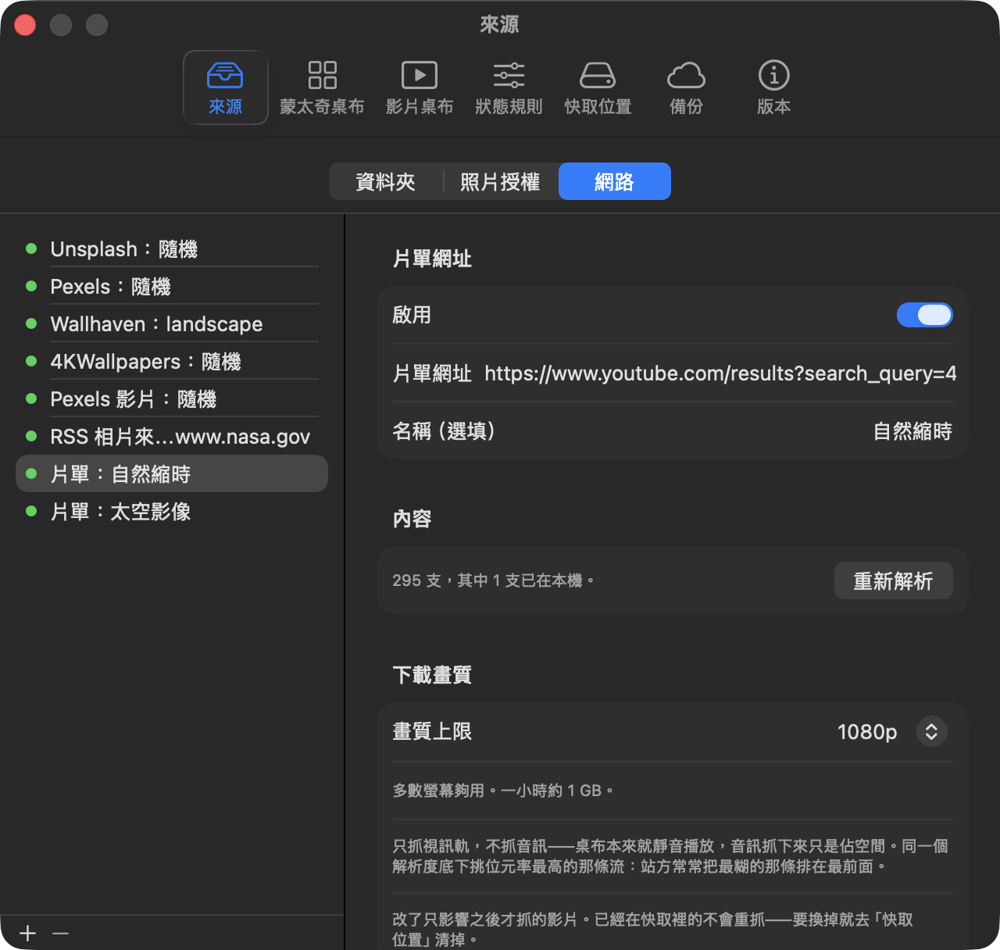
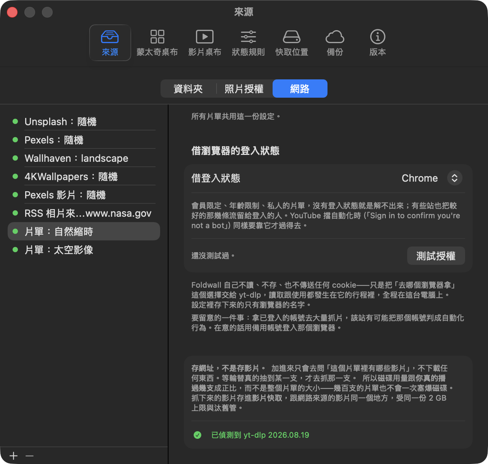
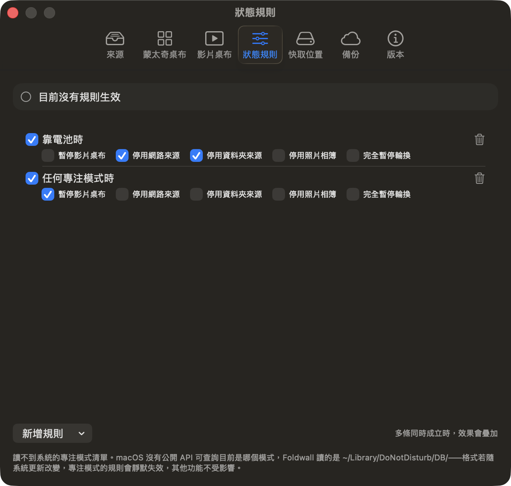
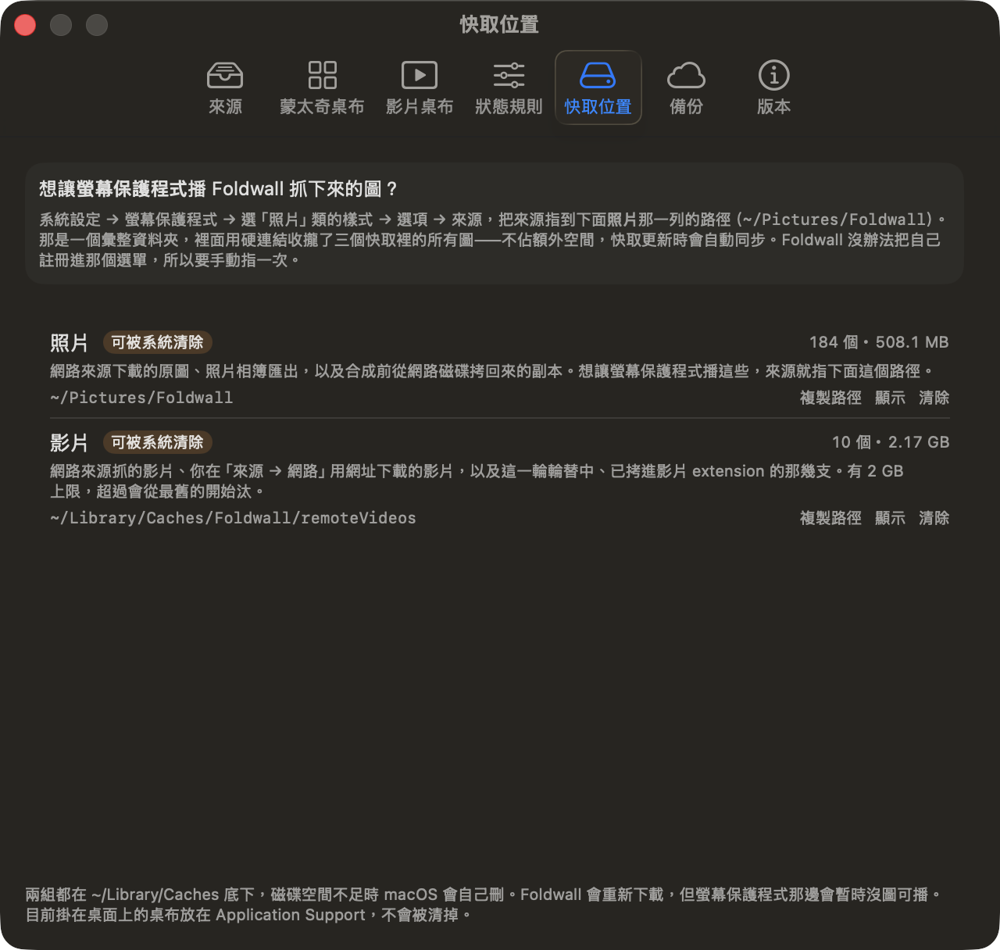
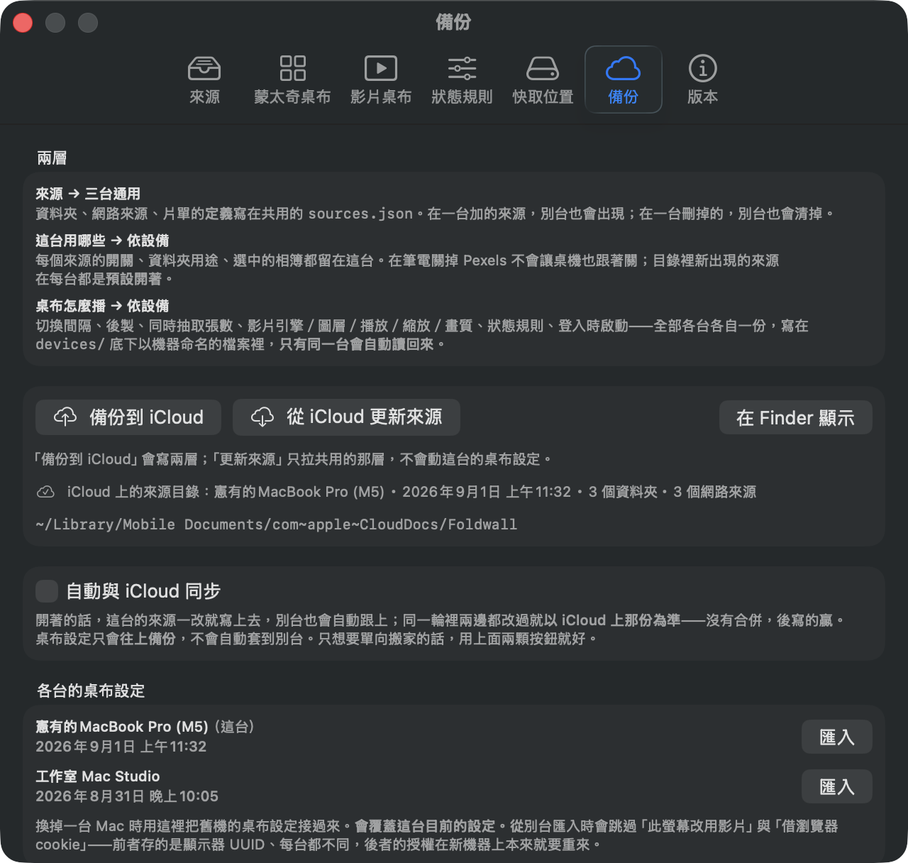
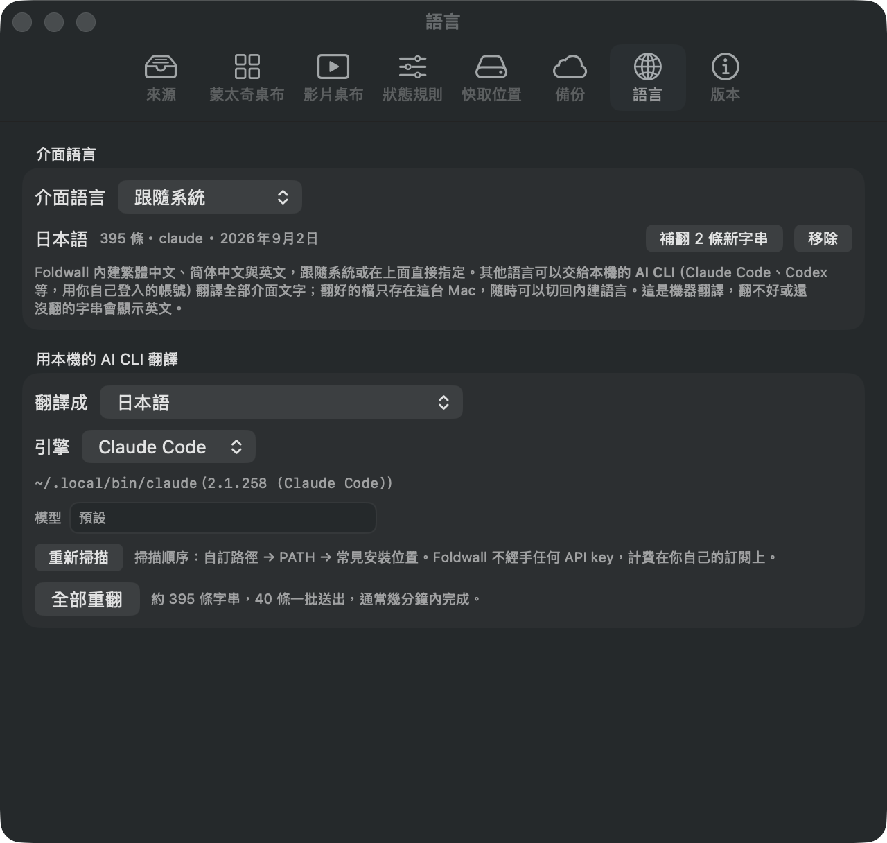

# Foldwall

macOS 選單列 app：把你的資料夾、照片相簿與網路來源混成**隨機蒙太奇**桌布，每台螢幕各自合成、定時換一張。也能讓指定螢幕改播影片。

需要 macOS 26 以上、Apple Silicon。介面有繁體中文、简体中文與英文，跟隨系統或自己指定；其他語言可以在「設定 → 語言」用你本機已登入的 AI CLI（Claude Code、Codex 等）自己翻一份，翻好的檔只留在這台 Mac。

## 安裝

到 [Releases](https://github.com/gixiphy/foldwall/releases/latest) 下載 `Foldwall-<版本>-arm64.dmg`，打開後把 Foldwall 拖進「應用程式」。

DMG 已經 Apple 公證，不必解 quarantine。

## 怎麼用

啟動後圖示在選單列，不進 Dock。日常要用的都在這裡，設定視窗只有調整時才需要打開。



**設定 → 來源**加來源，加好就會進同一個蒙太奇池：

| 來源 | 在哪裡加 | 說明 |
| --- | --- | --- |
| **資料夾** | 來源 → 資料夾 | 本機、SMB，以及 Box／pCloud／Dropbox／OneDrive／Google Drive 等 File Provider 掛載點都算資料夾 |
| **照片相簿** | 來源 → 照片授權 | 走 PhotoKit，首次會跳系統授權 |
| **網路** | 來源 → 網路 | Unsplash／Pexels／Pixabay／Wallhaven／Flickr 公開搜尋／Immich／RSS／4KWallpapers。需要 key 的存在 Keychain |
| **片單網址** | 來源 → 網路 → ＋ | 一條網址代表一整批影片。需要你自己裝 `yt-dlp`，見下面 |



這一頁只管來源設好了沒、讀不讀得到。每個來源要不要用，在「蒙太奇桌布」和「影片桌布」分頁**各自勾選**——同一個資料夾可以只給蒙太奇、只給影片，或兩者都給。

## 蒙太奇桌布

每 5 分鐘換一次構圖（間隔可改）。多螢時每台各自抽圖、各自合成，同一時間兩台不會是同一張。

**一張蒙太奇會盡量涵蓋多個來源**，不會被張數最多的那個來源吃掉整張圖。同一張圖裡也不會出現重複的片。



| 設定 | 說明 |
| --- | --- |
| **切換間隔** | 預設 5 分鐘 |
| **後製** | 無／灰階／棕褐／去飽和／**隨機**。整張合成完再套一次；隨機是每輪各抽一種 |
| **顯示來源與作者** | 把出處印在圖片角落。Unsplash 與 Pexels 的授權要求標註作者——**關掉之後這兩個來源的圖只適合自己看** |
| **張數上限** | 1 到 20，預設**自動** |

自動的意思是上限由螢幕長邊決定（超寬螢幕多、筆電螢幕少），每輪實際幾張是在 1 到上限之間隨機抽的——有時一張大圖、有時鋪滿十幾張。降載時上限封頂 6 張。每台螢幕算到的上限列在設定裡。

## 影片桌布

預設關閉。打開後有兩條路，在「影片桌布 → 播放方式」選：



| | 桌面視窗（預設） | 系統桌布 extension |
| --- | --- | --- |
| 怎麼播 | 直接播來源檔 | 要先實體拷進沙盒 |
| 佔磁碟 | **不佔**，零拷貝 | 一輪填到 2GB 為止，單檔上限 1GB；每輪只換其中 512MB |
| 能播的範圍 | 整個片庫 | 只有拷進去的那幾支 |
| **鎖屏** | **不會播** | **會播** |
| 設定步驟 | 選單勾「此螢幕改用影片」 | 系統設定選片 **＋** 選單勾「此螢幕改用影片」 |
| 穩定性 | 穩定 | macOS 大版本更新可能失效 |

除非你要鎖屏也播影片，否則用預設的桌面視窗就好。

桌面視窗那條還有一個**圖層**選項：影片放在「桌面圖示之下」（預設）或「蓋住桌面圖示」。系統 extension 那條由系統決定，沒有這個選擇。

系統 extension 那條要**兩步**：只做第一步（系統設定選片）的話，下一輪靜態桌布會把影片蓋掉。

播不動的影片（來源掉線、檔案壞掉）會自動冷卻 10 分鐘、改播別的，不會停在黑畫面。

### 縮放

影片跟螢幕的長寬比很少剛好一樣。在「影片桌布 → 播放方式 → 縮放」選（**兩條引擎都吃**，選單列的「影片縮放」也一樣）：

| 縮放 | 行為 |
| --- | --- |
| **填滿螢幕**（預設） | 等比放大到蓋滿螢幕，超出畫面的裁掉。不會有黑邊，但拍到的東西可能被切到 |
| 填滿高度 | 以**螢幕高度**為準等比縮放：上下貼齊螢幕，左右超出的裁掉、不夠寬的留左右黑邊 |
| 填滿寬度 | 以**螢幕寬度**為準等比縮放：左右貼齊螢幕，上下超出的裁掉、不夠高的留上下黑邊 |
| 符合螢幕大小 | 等比縮到整支影片都看得見。長寬比跟螢幕不一樣就會留黑邊 |
| 隨機 | 每支影片各自抽一種（填滿螢幕／符合螢幕大小）。同一支在同一台螢幕上抽到的固定不變，不會播到一半自己跳 |

**每一種都保持影片原本的長寬比。** 系統設定的桌布有一個「擴充至填滿螢幕」是把畫面拉扁去湊螢幕的，這裡刻意不提供——桌布把每支影片都變形不是想要的結果。

改了立刻生效，正在播的那支不會重播。

### 播完之後

**預設播完接下一支。** 在「影片桌布 → 播放方式 → 播完之後」選（選單列的「影片播放方式」也一樣）：

| 模式 | 行為 |
| --- | --- |
| 單片循環 | 一支放到底再接回開頭，永遠是同一支。接回開頭是無縫的 |
| **全部循環**（預設） | 播完接下一支，走到底回到第一支 |
| 隨機播放 | 播完隨機挑下一支。下一支不會是剛播完的那支 |

想立刻換就按選單列的**下一片影片**（⇧⌘N）。多螢時三種模式都會避開別台正在播的那支。

這三個是**桌面視窗**那條路的設定。系統 extension 的輪替歸「系統設定 → 桌布」管：選 **Shuffle All** 才會輪播，頻率在它的 *Change Video* 選單裡挑，其中 **After Each Video** 就是「播完接下一支」（換片是無縫的）。選了固定某一支就等於單片循環。「下一片影片」在那條路也有效——但只有選 Shuffle All 時才有東西可跳。

### 換一批片源

「下一片影片」是在**當下這份片單**裡往前一支。要把片單本身換掉，按「影片桌布 → 播放方式 → **強制更換片源**」：

| 引擎 | 按下去會 |
| --- | --- |
| 桌面視窗 | 重掃來源資料夾再整批重抽。剛丟進資料夾的新片、剛掛回來的網路磁碟，會在這時候出現 |
| 系統 extension | 立刻拷一批新的進去，不等螢幕睡著 |

系統 extension 那條平時只在螢幕睡著時換批，而且最少隔 30 分鐘——一批可能是好幾百 MB，放在你剛回到電腦前那一刻拷會卡。等不及就按這個。

兩邊都不會順便去打網路來源的 API 補貨，那有額度上限。

## 片單網址與 yt-dlp

片單網址**存的是網址，不是影片**。加進來只會去問「這個片單裡有哪些影片」，等輪替真的抽到某一支，才去抓那一支。所以磁碟用量跟**你真的播過幾支**成正比，幾百支的片單也不會一次塞爆。



這個功能靠**你自己安裝的 yt-dlp**：

```bash
brew install yt-dlp
```

也建議一起裝 `ffmpeg`（`brew install ffmpeg`）：現在的 YouTube 幾乎只提供分離的視訊／音訊軌，沒有它一支也抓不下來。

Foldwall 不實作任何串流解析或簽章繞過——那是規避技術保護措施。它只負責找到工具、組出參數、把結果收進影片來源；要對哪個站用由你決定。沒裝就是這個功能用不了，其他來源不受影響。

### 畫質

「來源 → 網路 → 選一條片單」裡可以設**畫質上限**（720p 到不設上限，預設 1080p），所有片單共用。同一個解析度底下一律挑位元率最高的那條流——這件事需要明講，因為 yt-dlp 預設的排序會先比編碼再比位元率，而站方位元率壓得最狠的那條編碼常常排在最前面，於是「最偏好的編碼」剛好是「畫質最差的流」。實測同一支 1080p60：預設拿到 557 kbps，改過之後拿到 1206 kbps。

**只抓視訊軌，不抓音訊**：桌布本來就靜音播放，音訊抓下來只是佔空間。

改了只影響之後才抓的影片，已經在快取裡的不會重抓——要換掉就去「快取位置」清掉。

### 借瀏覽器的登入狀態



會員限定、年齡限制、私人的片單，沒有登入狀態就是解不出來；YouTube 擋自動化時（`Sign in to confirm you're not a bot`）也要靠它才過得去。同一個地方可以選「借哪個瀏覽器的登入狀態」，旁邊有「測試授權」會真的跑一次告訴你成不成，不成的話缺哪一道權限。

- **Safari** 的 cookie 在系統保護的位置，要去「隱私權與安全性 → 完全取用磁碟」把 **Foldwall** 打開（要授權的是 Foldwall 不是 yt-dlp：子行程的授權判定歸屬於把它叫起來的那個 app）。
- **Chrome／Brave／Edge 等**的 cookie 是加密的，第一次讀會跳鑰匙串詢問，選「總是允許」。
- **Firefox** 兩樣都不用，不想開權限的話用它最省事。

Foldwall 自己不讀、不存、也不傳送任何 cookie——只是把「去哪個瀏覽器拿」交給 yt-dlp，讀取跟使用都在它的行程裡，全程在這台電腦上；設定裡存下來的只有瀏覽器的名字。要留意的是拿已登入的帳號大量抓片，該站有可能把那個帳號判成自動化行為，在意的話用備用帳號。

## 狀態規則

「設定 → 狀態規則」讓桌布跟著系統狀態變：靠電池時別打網路、工作模式時暫停影片，諸如此類。



一條規則是「條件 → 效果」。條件有兩種：**靠電池時**（沒接電源）、**專注模式啟用時**（任何一種，或指定某一個）。效果可以複選：

| 效果 | 做什麼 |
| --- | --- |
| 暫停影片桌布 | 影片螢幕改回蒙太奇，也不再輪替影片 |
| 停用網路來源 | 不打 API、不下載。已經快取的圖照用 |
| 停用資料夾來源 | SMB／雲端硬碟在電池上很耗 |
| 停用照片相簿 | 相簿的圖這一輪不進池 |
| 完全暫停輪換 | 保留現在這張，什麼都不換 |

規則是扁平的清單，**多條同時成立就把效果聯集起來**——任一條說要停就停。刻意不做優先序或互斥，那需要一整套衝突解決 UI，而聯集的語意既夠用又好預測。

專注模式那組有個前提：macOS 沒有公開 API 查得到「現在是哪個專注模式」，Foldwall 讀的是 `~/Library/DoNotDisturb/DB/`。格式若隨系統更新改變，專注模式的規則會**靜默失效**，其他功能不受影響。

## 快取與螢幕保護程式

抓下來的圖與影片分成兩份，都在「設定 → 快取位置」看得到、清得掉。



| | 路徑 | 裝什麼 |
| --- | --- | --- |
| **照片** | `~/Pictures/Foldwall` | 網路來源下載的原圖、照片相簿匯出，以及合成前從網路磁碟拷回來的副本 |
| **影片** | `~/Library/Caches/Foldwall/remoteVideos` | 網路來源抓的影片、片單下載的影片，以及這一輪已拷進 extension 的那幾支。2 GB 上限，超過從最舊的開始汰 |

實際的檔案都躺在 `~/Library/Caches` 底下——照片那一列是彙整入口，下面會說。所以兩份都是**磁碟空間不足時 macOS 會自己刪**的。刪掉 Foldwall 會重新下載，只是螢保那邊會暫時沒圖可播。目前掛在桌面上的那張桌布放在 Application Support，不會被清掉。

想讓**系統的螢幕保護程式**播 Foldwall 抓下來的圖：系統設定 → 螢幕保護程式 → 選「照片」類的樣式 → 選項 → 來源，指到 `~/Pictures/Foldwall`。那是一個彙整資料夾，用**硬連結**把散在幾個快取目錄裡的圖收在一起——不佔額外空間，快取更新時自動同步。Foldwall 沒辦法把自己註冊進那個選單，所以要手動指一次。

## 備份設定

「設定 → 備份」可以把設定寫到 iCloud Drive。也可以開自動同步（預設關）。



設定分成**兩層**，因為多台 Mac 上「來源」與「桌布怎麼播」該不該一致，答案不一樣：

| 層 | 檔案 | 誰讀 | 裝什麼 |
| --- | --- | --- | --- |
| **來源目錄** | `Foldwall/sources.json` | 每台共讀共寫 | 資料夾路徑、網路來源的關鍵字、片單網址 |
| **裝置設定** | `Foldwall/devices/<機器名>.json` | 只有同一台會自動讀回 | 這台開哪些來源，以及桌布怎麼播 |

分界線是**「有什麼」與「用什麼」**。在筆電加的資料夾，桌機也會出現；在筆電**關掉**的 Pexels，桌機照樣開著。目錄裡新出現的來源在每台都是預設開著的——跟你自己按「新增」當下的直覺一致。

依設備的有：每個來源的開關、資料夾用途、選中的相簿、切換間隔、後製、張數上限、狀態規則、影片引擎、圖層／播放／縮放／畫質、登入時啟動，還有「此螢幕改用影片」的勾。

**換掉一台 Mac 時**，到「設定 → 備份 → 各台的桌布設定」把舊機那份匯入。從別台匯入會跳過「此螢幕改用影片」與「借瀏覽器 cookie」：前者存的是顯示器 UUID、每台都不同，後者的授權在新機器上本來就要重來。

備份**不含 API key**——那份是明文 JSON，躺在 iCloud Drive 裡會被 Spotlight 索引。換機器時到「來源 → 網路」重輸一次。

資料夾存的是**路徑**不是書籤（書籤綁機器），另一台沒掛那顆磁碟的路徑會被跳過——但**不會**從共用目錄裡消失，碟掛回來就恢復。照片相簿連名稱一起存，因為相簿的內部 id 每台機器都不同。

> **從 0.6.x 升上來**：舊的 `settings.json` 會在第一次同步時自動拆成上面兩份，原檔留著不動。**所有機器都要更新到 0.7.0** ——沒更新的那台還在讀寫 `settings.json`，兩邊看不到彼此的改動。

## 介面語言

介面內建繁體中文、简体中文與英文：跟隨系統，或在「設定 → 語言」直接指定。其他語言不由我這邊維護——沒有人能校對——而是交給**你本機已登入的 AI CLI** 翻一份。



翻譯來源是內建的**英文**（模型英譯外語的品質普遍比中譯外語好，繁中原文一起附上當第二參考），約 400 條字串，分批送出，**批量依引擎的速度與回覆完整度自動調整**（快的引擎一批上百條，慢的十來條），同時跑四批，通常幾分鐘跑完。

| 項 | 說明 |
| --- | --- |
| **支援的 CLI** | Claude Code、Codex CLI、Antigravity、Grok Build、OpenCode、Pi。掃描順序是自訂路徑 → `PATH` → 常見安裝位置；沒偵測到的可以直接填執行檔完整路徑。 |
| **模型不用自己猜** | 問得到清單的引擎（Antigravity、Grok、OpenCode、Codex、Pi）在模型欄位旁給下拉選單，直接挑；Claude Code 給 `opus`／`sonnet`／`fable`／`haiku` 這些恆指向當代最新模型的別名。欄位**永遠可以自由輸入**——清單可能過期或列不全，不該因此擋住你想用的模型。 |
| **不經手 API key** | Foldwall 呼叫的是你自己登入的 CLI，計費在你自己的訂閱上。這個 app 裡沒有任何金鑰欄位。 |
| **四個選項＋自翻的** | 「介面語言」可以選跟隨系統、繁體中文、简体中文、English，以及任何你自己翻好的語言。 |
| **要重新啟動** | 選好語言之後要重開 Foldwall 才會換。已經畫出來的介面不會因為換了字串表就重繪，與其做半套熱切換不如講清楚。 |
| **檔只在這台** | 翻好的字串存在 `~/Library/Application Support/Foldwall/UITranslations/`，**不進 iCloud 備份**。選回內建語言不會刪檔，隨時切得回去。 |
| **翻不好的退回英文** | 機器翻譯沒有人校對。格式符號（`%@`、`%lld`）數量或型別對不上的字串會被丟掉、顯示英文，不會變成亂碼或 key 本身。 |
| **升版之後** | 新版多出來的字串會顯示「補翻 N 條新字串」，只送缺的那幾條，已翻的不重跑。 |

每翻完一批就寫一次檔，所以中途按取消或斷在一半，已經翻好的都留著。模型漏回的字串會退回佇列再送一次，整批失敗會把批量砍半重送，而不是直接放棄。

## 會撞到的限制

| 項 | 說明 |
| --- | --- |
| **TCC 授權** | 首次存取桌面／文件／下載、網路磁碟區、`~/Library/CloudStorage/*` 會跳系統授權框。重灌會重跳。嫌煩可自行給 Full Disk Access。 |
| **多 Space** | 靜態桌布只寫每螢**當前 Space**，其他 Space 停留舊圖。影片桌布沒有這個問題。 |
| **來源要先掛載** | 沒有雲端硬碟的 OAuth 登入，這類來源必須是 Finder 已掛載的路徑。斷線就標離線、換下一張，**不會黑屏**。 |
| **第一次掃大型來源要等** | 資料夾索引在背景跑，不擋出圖——網路與相簿來源幾秒就有第一張。索引會存到磁碟，**之後開啟不必重掃**，池從第一秒就是滿的。 |
| **網路來源有速率上限** | 免費 API 額度有限（例如 Unsplash 每小時 50 次）。Foldwall 會快取抓下來的圖當池用，不會每 5 分鐘打一次 API。 |
| **專注模式規則可能失效** | macOS 沒有可靠的方式查得到「目前是哪個專注模式」。查不到就當沒開、規則靜默失效，桌布不受影響。 |
| **影片快取會自動汰舊** | 網路來源與片單抓下來的影片共用一份 2 GB 上限，超過從最舊的開始刪。 |
| **Gatekeeper** | 0.6.0 起的 DMG 已經 Apple 公證，直接打開安裝即可。更舊的版本要先 `xattr -dr com.apple.quarantine /Applications/Foldwall.app`。 |

鎖屏：macOS 14 起鎖屏預設顯示桌布，所以靜態蒙太奇會**免費出現在鎖屏**。

## 刻意不做的

- **YouTube 內建支援**。三條路全不通：Data API 是 Google API；官方 IFrame 嵌入要求播放器可見、不被遮蔽、顯示廣告，桌布定義上就違反；抽 `googlevideo` 串流網址是規避技術保護措施。**串流不比下載寬鬆。** 你要對哪個站用自己的 yt-dlp 是你的決定，那條界線在你手上，不在這個 app 裡。
- **OAuth 來源**（SmugMug、Flickr 私人相簿）。Flickr 只支援公開搜尋。
- **App Sandbox 與 Mac App Store**。

## 授權

MIT，見 [LICENSE](LICENSE)。

影片桌布 extension（`FoldwallExtension/`）fork 自 [Phosphene](https://github.com/kageroumado/phosphene)（MIT，作者 kageroumado），授權原文保留在 [ThirdParty/Phosphene-LICENSE](ThirdParty/Phosphene-LICENSE)。
