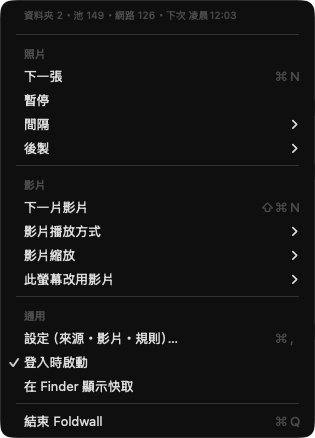
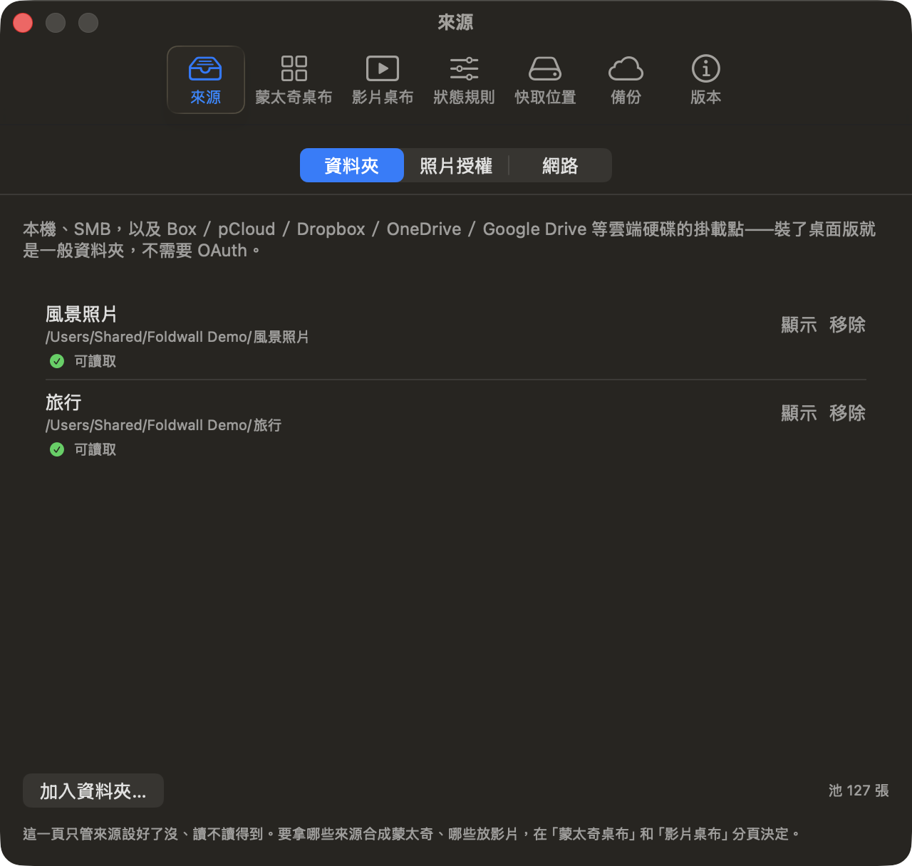
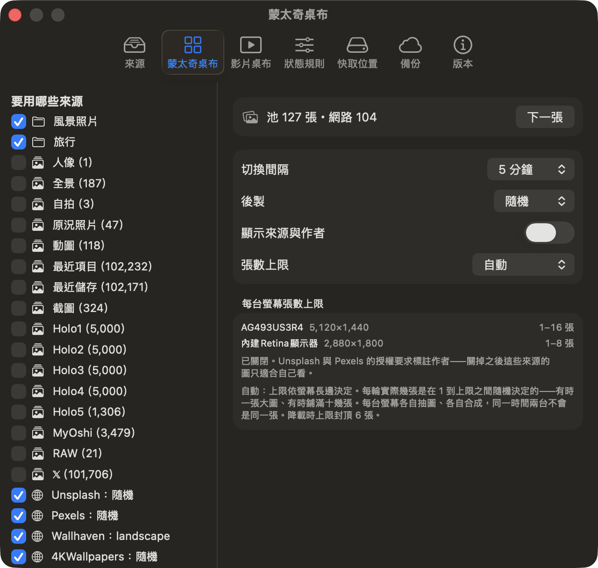
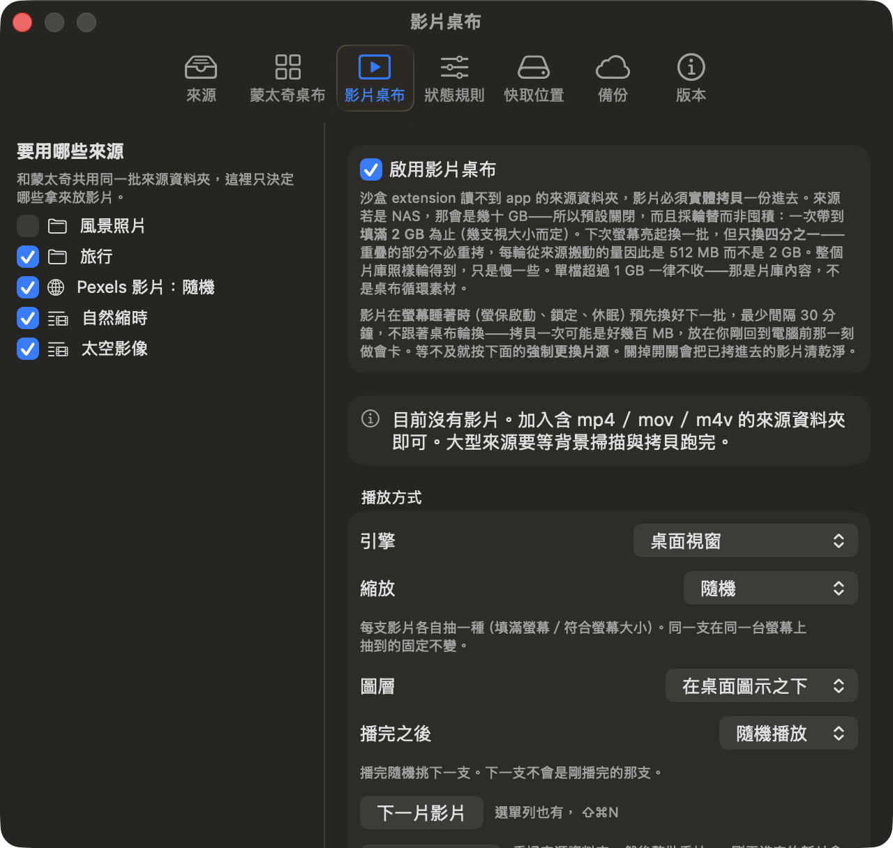
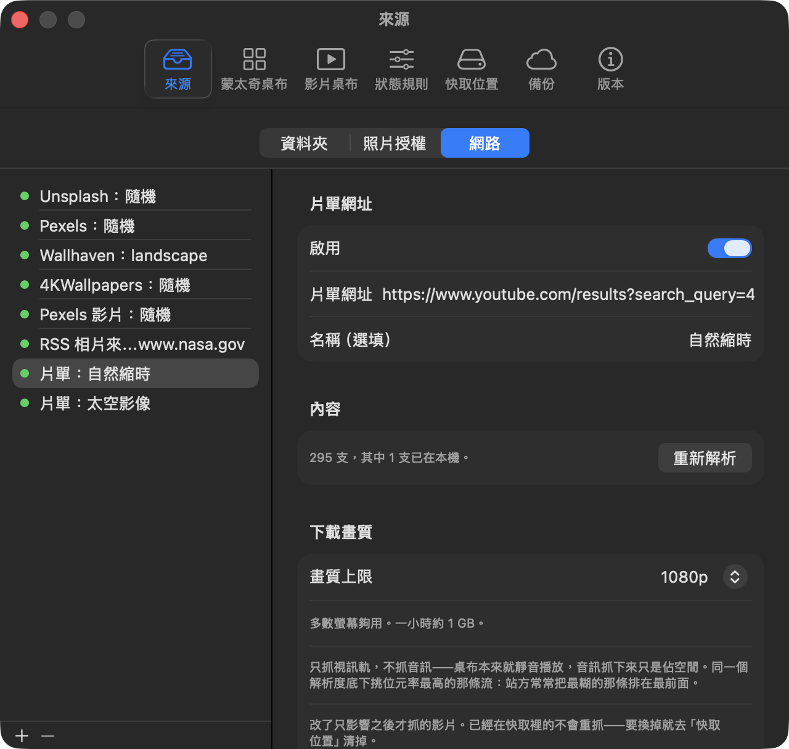
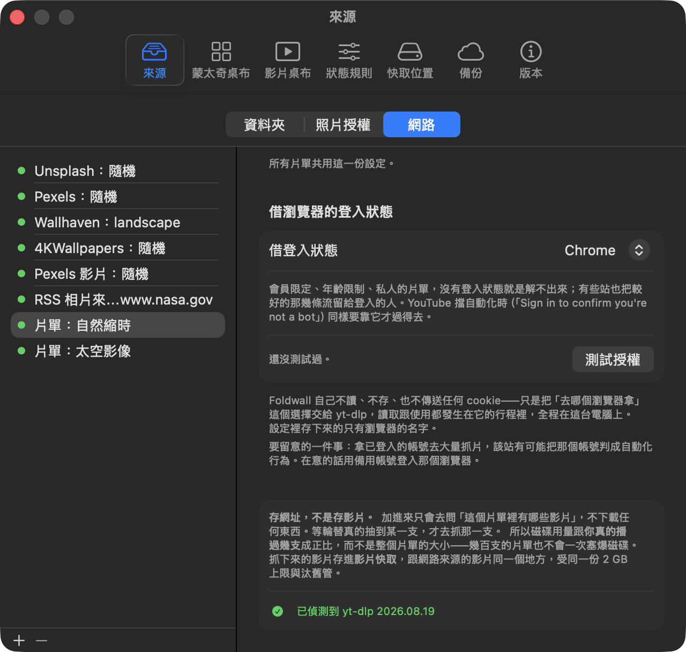
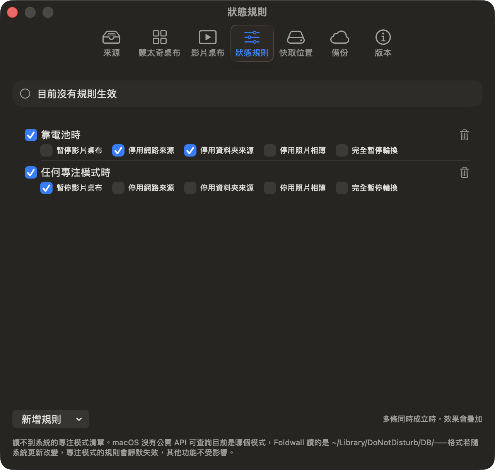
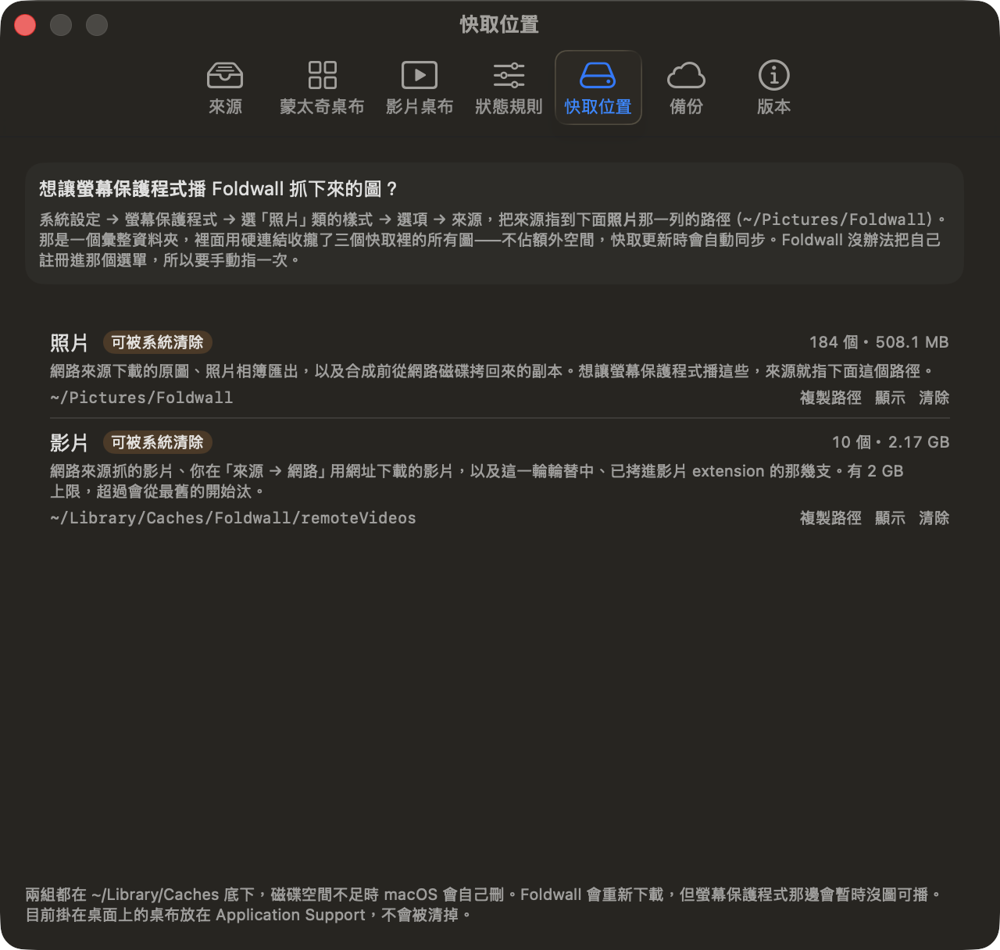
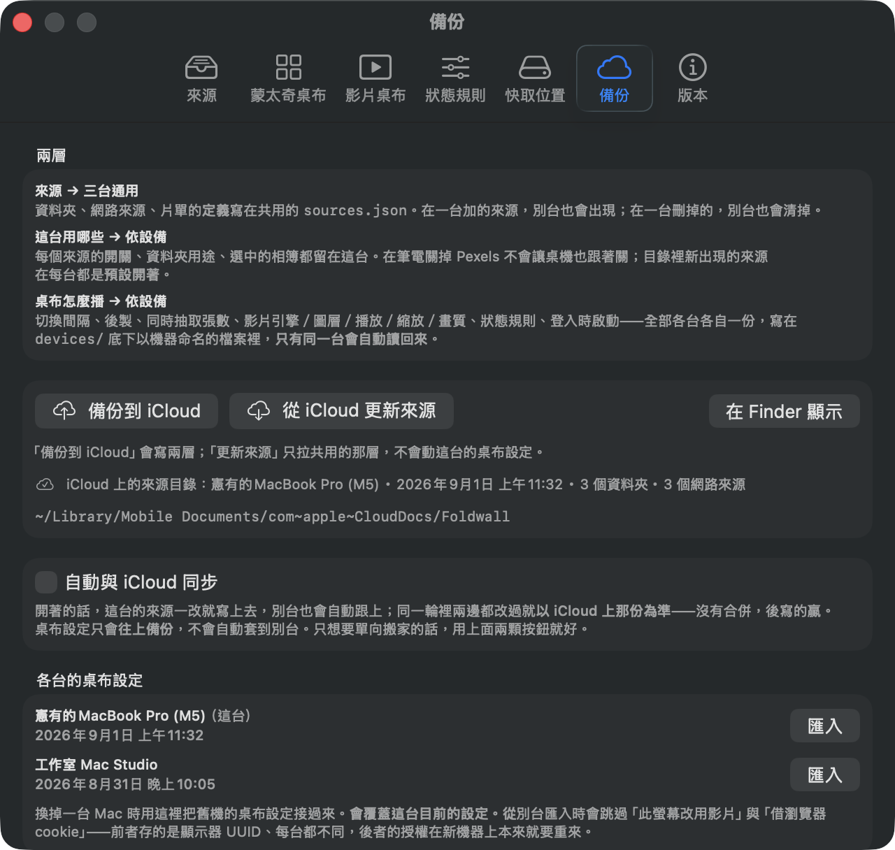
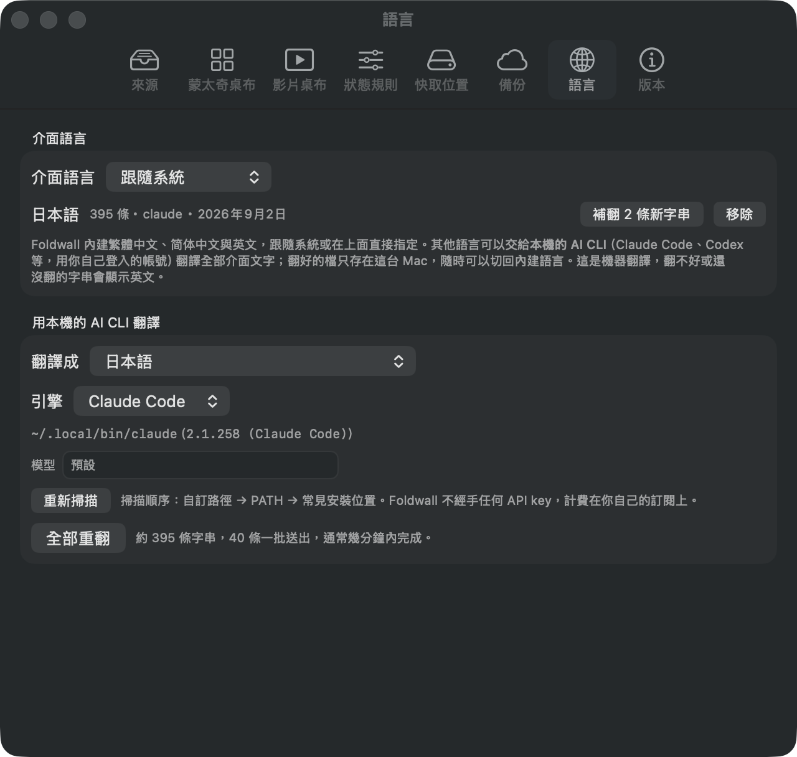

# Foldwall

A macOS menu-bar app that mixes your folders, photo albums, and web sources into a **random montage** wallpaper. Each display is composed on its own and changes on a timer. Chosen displays can play video instead.

**Random montage · per-display composition · optional video wallpaper**

Requires macOS 26 or later, on Apple Silicon. The interface includes Traditional Chinese, Simplified Chinese, and English, following the system language or a language you set. Any other language can be translated on this Mac from Settings → Language, using an AI CLI you are already signed in to (Claude Code, Codex, and others). The translated file stays on this Mac.

## Install

Download `Foldwall-<version>-arm64.dmg` from [Releases](https://github.com/gixiphy/foldwall/releases/latest), open it, and drag Foldwall into Applications.

The DMG is notarized by Apple. The quarantine attribute does not need to be cleared.

## How to use

After launch the icon sits in the menu bar and does not appear in the Dock. Day-to-day controls are there. Open the Settings window only when you need to change something.



Add sources under **Settings → Sources**. Everything you add joins the same montage pool:

| Source | Where to add it | Notes |
| --- | --- | --- |
| **Folder** | Sources → Folders | A local folder, an SMB share, or a File Provider mount (Box, pCloud, Dropbox, OneDrive, Google Drive, and the like) all count as folders |
| **Photo album** | Sources → Photos Access | Uses PhotoKit. The system permission prompt appears the first time |
| **Web** | Sources → Web | Unsplash, Pexels, Pixabay, Wallhaven, Flickr public search, Immich, RSS, and 4KWallpapers. Keys a source needs are stored in the Keychain |
| **Playlist URL** | Sources → Web → + | One URL stands for a whole batch of videos. You install `yt-dlp` yourself; see below |



This page only reports whether a source is configured and readable. Whether a source is used is checked separately on the Montage and Video tabs — the same folder can feed the montage only, video only, or both.

## Montage wallpaper

The composition changes every 5 minutes (the interval is adjustable). With more than one display, each display draws and composites on its own, so two displays are never showing the same image at once.

**One montage tries to cover several sources.** The source with the most images does not take over the whole frame. The same image does not appear twice inside one montage.

When usable images run short, the piece count drops. When no extra image is available for the background, a solid color is used. A duplicate is not pasted in to fill the space.



| Setting | Notes |
| --- | --- |
| **Change interval** | Default 5 minutes |
| **Effect** | None / Grayscale / Sepia / Desaturate / **Random**. Applied once to the finished composite. Random draws one effect per round |
| **Show source and credit** | Prints the attribution in a corner of the image. The Unsplash and Pexels licenses require author credit — **with this off, images from those two sources are only suitable for your own viewing** |
| **Max images** | 1 to 20. Default **Automatic** |

Automatic means the cap follows the display’s long edge (higher on an ultrawide, lower on a laptop). Each round draws a count at random between 1 and that cap — sometimes one large image, sometimes a dozen or more tiled. Under power saving the cap is clamped at 6. The cap computed for each display is listed in Settings.

## Video wallpaper

Off by default. Once it is on, there are two paths, chosen under Video → Playback:



| | Desktop window (default) | System wallpaper extension |
| --- | --- | --- |
| How it plays | Plays the source file directly | Physically copied into the sandbox first |
| Disk use | **None** — zero copy | Fills a batch up to 2 GB, with a 1 GB limit per file; each round replaces only 512 MB of that batch |
| What can play | The whole library | Only the files that were copied in |
| **Lock screen** | **Does not play** | **Does play** |
| Setup | Check “Use Video on This Display” in the menu | Pick the display and the video in System Settings |
| Stability | Stable | A major macOS update may break it |

Use the default desktop window unless you also want video on the lock screen.

The desktop-window path has a **Layer** option: “Below desktop icons” (default) or “Above desktop icons”. The system-extension path is placed by the system and has no such choice.

The desktop-window path can also pick a **Core**: Compatible playback (AVPlayer, the default) or Smooth playback (mpv, which you install yourself). See “Smooth playback and mpv” below.

Playback displays for the system extension are chosen in System Settings → Wallpaper. Select a Foldwall video there; there is no need to go back and check the menu. Foldwall skips any display that already has a system video wallpaper assigned.

A video that cannot play (the source is offline, or the file is damaged) cools down for 10 minutes and something else plays. Playback does not stay on a black frame.

### Scaling

A video’s aspect ratio rarely matches the screen. Choose the mode under Video → Playback → Scaling (**both engines honor it**, and so does Video Scaling in the menu bar):

| Scaling | Behavior |
| --- | --- |
| **Fill Screen** (default) | Scales up proportionally until the screen is covered, and crops the overflow. No bars, though part of the frame may be cut off |
| Fill Height | Scales proportionally to the **screen height**: the top and bottom meet the screen. Anything wider is cropped; anything narrower leaves bars on the left and right |
| Fill Width | Scales proportionally to the **screen width**: the left and right meet the screen. Anything taller is cropped; anything shorter leaves bars above and below |
| Fit to Screen | Scales proportionally until the whole video is visible. Leaves bars when the aspect ratio differs from the screen |
| Random | Each video draws its own mode (Fill Screen or Fit to Screen). The same video on the same display always draws the same mode, and does not switch mid-playback |

**Every mode keeps the video’s original aspect ratio.** System Settings has a wallpaper option, “Stretch to Fill Screen”, that squashes the picture to fit the screen. It is deliberately omitted here. Distorting every video is not the intended result.

A change takes effect immediately. The video that is already playing is not restarted.

### Ambient glow

For scaling modes that leave bars, turn on Video → Ambient Glow. It extends the colors at the video’s edges outward into the bars, fading and blurring them, and shifts gently as the video plays (inspired by [x-ambient](https://github.com/mmnga/x-ambient)). **Off by default.** Desktop window engine only; works with both the AVPlayer and mpv cores.

| Control | Default | What it does |
| --- | --- | --- |
| Intensity | 60% | Brightness of the glow relative to the video |
| Softness | Medium | Blur radius |
| Spread | Medium | How far the glow travels from the video’s edge before fading out |
| Follow video colors | On | When off, each video takes its colors once and keeps them. The system’s Reduce Motion setting does the same |

- It only runs when there really are bars: nothing happens when the applied scaling is Fill Screen or the video matches the screen’s aspect ratio. Fill Height, Fill Width and Random follow whatever each video actually resolves to.
- The video keeps its own frame rate; the glow updates at most 12 times per second, computed on a 64-pixel image. It stops updating while paused or fully covered by a full-screen window, and skips frames that barely change. Measured worst case (1080p, colors changing constantly): about 3% of one CPU core, no extra memory.
- Changes apply immediately and playback continues. The settings are part of the device settings, so they are backed up and synced.

### When one ends

**The default is to move on to the next video.** Choose the mode under Video → Playback → When one ends (Video Playback in the menu bar is the same control):

| Mode | Behavior |
| --- | --- |
| Loop One | Plays one video through, then loops back to its start — always the same video. The loop back to the start is seamless |
| **Loop All** (default) | Moves to the next video when one ends, and wraps back to the first at the end of the list |
| Shuffle | Picks the next video at random when one ends. The next one is never the one that just finished |

To change immediately, use **Next Video** in the menu bar (⇧⌘N). With more than one display, all three modes avoid the video another display is already playing.

These three modes apply to the **desktop window** path. Rotation for the system extension is controlled by System Settings → Wallpaper: choose **Shuffle All** to rotate at all, and pick the frequency in its *Change Video* menu. **After Each Video** there means “move on when one ends”, and the change is seamless. Picking one fixed video is the same as Loop One. **Next Video** works on that path too. There is something to skip to only when Shuffle All is selected.

### Repeat display limits

Both the Montage and Video settings pages have **Repeat display limits**. The two pages edit the same setting.
On by default: the same item is shown at most **once in the last 1 day**. The window is a number plus a unit. Units are hours (1–720), days (1–365), weeks (1–52), and months (1–12, counted as calendar months). The count is 1–100, or the limit can be turned off.
Images and shuffled videos both obey it, including Shuffle All on the system extension. Loop One and Loop All keep their original behavior.
A count is recorded only after the item is actually shown. Preload and a failed load do not count. The record is stored on this Mac and still applies after the app is relaunched.
When every item has reached the cap, the current wallpaper stays until something becomes available again. Images are tried again at the next scheduled update.

### Replacing the selection

**Next Video** advances within the **current list**. To replace the list itself, press Video → Playback → **Force New Selection**:

| Engine | What the button does |
| --- | --- |
| Desktop window | Rescans the source folders and redraws the whole batch. A video just dropped into a folder, or a network volume just mounted again, shows up at this point |
| System wallpaper extension | Copies a new batch in immediately, without waiting for the display to sleep |

The system-extension path otherwise replaces its batch only while the display is asleep, and at least 30 minutes apart — a batch can be several hundred megabytes, and copying it the moment you sit back down would stall. Press the button when you would rather not wait.

Neither path calls web-source APIs to restock. Those APIs have a quota.

## Smooth playback and mpv

The desktop-window engine has two players. **Compatible playback (AVPlayer)** is the default: it is built into the system and nothing else has to be installed. **Smooth playback (mpv)** uses an mpv you installed yourself. Some files (one measured case was an H.264 original at 29.97 fps) keep micro-stuttering in AVPlayer and play smoothly in mpv; the reverse happens too. Switch under Video → Playback → Core. Only the video window is affected: the montage is not recomposed, and the video that is playing continues from the same second.

This depends on **an mpv you install yourself**:

```bash
brew install mpv
```

Restart Foldwall after installing. The boundary is the same as for yt-dlp: Foldwall does not bundle libmpv, does not download it, and does not run brew for you. mpv and the FFmpeg it links against are GPL builds. Foldwall (MIT) loads that build at run time only after you have installed it. The source tree contains only mpv’s client API headers (ISC, `ThirdParty/mpv`).

If mpv is missing or cannot be loaded, playback falls back to compatible mode, and the settings page states the reason together with the matching command. Not found: `brew install mpv`. A dependency was replaced (for example by `brew upgrade ffmpeg`) and mpv has not been rebuilt against it: `brew reinstall mpv`. Too old, or the API version does not match: `brew upgrade mpv`. None of these is the video’s fault, so the video is not put on the cooldown list. After `brew upgrade mpv`, the video that is playing is left as it is; the new build takes effect on the next launch, and the settings page says to restart.

When a fullscreen window completely covers the wallpaper window, the system stops AVPlayer. mpv does not get that pause, or the power saving that comes with it, so Foldwall pauses mpv while it is fully covered and resumes it once the window is visible again. CPU and GPU measurements for both cores, visible and covered, are in `docs/mpv-integration-plan.md`.

## Playlist URLs and yt-dlp

A playlist URL **stores the URL, not the videos**. Adding one only asks which videos the playlist contains. A video is fetched when the rotation actually draws it. Disk use therefore scales with **how many you have actually played**. A playlist of several hundred does not fill the disk in one go.



This depends on **a yt-dlp you install yourself**:

```bash
brew install yt-dlp
```

Install `ffmpeg` as well (`brew install ffmpeg`). YouTube now serves separate video and audio tracks almost exclusively, and without ffmpeg not a single video can be fetched.

Foldwall implements no stream parsing and no signature bypass — that would be circumvention of a technical protection measure. It finds the tool, assembles the arguments, and takes the result in as a video source. Which sites you point it at is your decision. Without yt-dlp this feature is unavailable; every other source still works.

### Quality

With a playlist selected under Sources → Web, set a **quality limit** (from 720p up to no limit; the default is 1080p). All playlists share it. Within a given resolution, the highest-bitrate stream is always the one taken. That is deliberate: yt-dlp’s default sort compares codec before bitrate, and the codec a site compresses hardest often ranks first, so the “preferred codec” is the worst-quality stream. Measured on the same 1080p60 video: the default returned 557 kbps; after the change, 1206 kbps.

**Only the video track is fetched.** Wallpaper playback is muted, so an audio track would only take space.

A change affects videos fetched after it. Anything already in the cache is left as it is — clear it under Settings → Cache to replace it.

### Borrowing a browser sign-in



Members-only, age-restricted, and private playlists cannot be resolved without a signed-in session. The same session is what gets past YouTube when it blocks automation (`Sign in to confirm you're not a bot`). In the same place you choose which browser’s sign-in to borrow. **Test Access** beside it runs a real check and reports whether it worked, and which permission is missing when it did not.

- **Safari** keeps its cookies in a system-protected location. Turn **Foldwall** on under Privacy & Security → Full Disk Access. The app that needs permission is Foldwall, not yt-dlp: a child process is judged by the app that launched it.
- **Chrome, Brave, Edge, and the like** encrypt their cookies. The first read raises a Keychain prompt; choose “Always Allow”.
- **Firefox** needs neither. It is the least setup if you would rather not grant a permission.

Foldwall itself never reads, stores, or transmits a cookie. It only tells yt-dlp which browser to use. Reading and using the cookies both happen inside that process, entirely on this Mac. The only thing saved in settings is the browser’s name. Downloading heavily with a signed-in account can lead a site to treat that account as automated. Use a spare account if that matters to you.

## State rules

Settings → Rules lets the wallpaper follow system state: skip the network while on battery, pause video in a work Focus, and similar cases.



A rule is “condition → effect”. There are two conditions: **On battery** (not connected to power), and **while a Focus is on** (any Focus, or one you name). Effects can be combined:

| Effect | What it does |
| --- | --- |
| Pause video wallpaper | Video displays return to the montage, and videos stop rotating |
| Disable web sources | No API calls and no downloads. Images already cached are still used |
| Disable folder sources | SMB shares and cloud drives are expensive on battery |
| Disable photo albums | Album images stay out of the pool for this round |
| Pause rotation entirely | Keep the current image and change nothing |

Rules are a flat list. **When several match at once, their effects are unioned** — if any matching rule says to stop, it stops. Priority ordering and mutual exclusion are deliberately left out. Either would need a conflict-resolution UI, and the meaning of a union is enough and predictable.

The Focus conditions have a premise: macOS has no public API for “which Focus is active right now”. Foldwall reads `~/Library/DoNotDisturb/DB/`. If that format changes with a system update, Focus rules **fail silently**. Everything else keeps working.

## Cache and the screen saver

Downloaded images and videos are kept in two places. Both are listed under Settings → Cache, and both can be cleared there.



| | Path | What is stored |
| --- | --- | --- |
| **Photos** | `~/Pictures/Foldwall` | Originals downloaded from web sources, exports from photo albums, and copies pulled from a network volume before compositing |
| **Videos** | `~/Library/Caches/Foldwall/remoteVideos` | Videos fetched from web sources, videos downloaded from playlists, and the files copied into the extension for the current round. Capped at 2 GB; past that, the oldest are evicted first |

The files themselves live under `~/Library/Caches`. The Photos row is an aggregate entry over those files, described below, so both places are locations **macOS may delete on its own when disk space is low**. Foldwall downloads them again afterward. Until then the screen saver has nothing to play. The wallpaper currently on the desktop lives in Application Support and is left in place.

The system keeps files of its own. Every time the montage changes, the macOS picture wallpaper stores a full-screen BMP of that image (about 22 MB at 5120×1440), and the system does not reliably reclaim them. Those files sit in a system container. macOS does not let an app read them, and it shows no permission prompt, so Foldwall has to be turned on under Privacy & Security → Full Disk Access (then relaunch Foldwall). After that, each round clears the old files and keeps the last two generations per display. Until it is granted, Settings → Cache and the menu bar say so.

To have the **system screen saver** play images Foldwall has fetched: System Settings → Screen Saver → pick a Photos-style saver → Options → Source, and point it at `~/Pictures/Foldwall`. That folder is an aggregate. It gathers images scattered across several cache directories with **hard links** — no extra disk space, and it stays in sync as the caches update. Foldwall cannot register itself in that menu, so the folder has to be chosen once by hand.

## Backing up settings

Settings → Backup can write settings to iCloud Drive. Automatic sync can be turned on; it is off by default.



Settings are split into **two layers**, because “should the sources match?” and “should playback match?” have different answers across Macs:

| Layer | File | Who reads it | What it holds |
| --- | --- | --- | --- |
| **Source catalog** | `Foldwall/sources.json` | Every Mac reads and writes it | Folder paths, web-source keywords, playlist URLs |
| **Device settings** | `Foldwall/devices/<machine name>.json` | Only the same Mac reads it back automatically | Which sources this Mac has enabled, and how the wallpaper plays |

The split is **what exists** versus **what is used**. A folder added on the laptop also appears on the desktop. Pexels turned off on the laptop stays on for the desktop. A source that newly appears in the catalog arrives enabled on every Mac — the same result as pressing Add yourself.

Kept per device: each source’s on/off switch, folder role, selected albums, change interval, effect, max images, state rules, video engine, layer / playback / scaling / quality, Launch at Login, and the “Use Video on This Display” checks.

**When you replace a Mac**, import the old machine’s file under Settings → Backup → Wallpaper settings per Mac. Importing from another Mac skips “Use Video on This Display” and borrowing browser cookies. The first stores display UUIDs, which differ on every machine. The second needs its permissions granted again on the new Mac anyway.

The backup **does not include API keys**. The file is plaintext JSON, and on iCloud Drive it would be indexed by Spotlight. Enter keys again under Sources → Web when you change machines.

Folders are stored as **paths**, not bookmarks (a bookmark is bound to one machine). A path whose disk is not mounted on the other Mac is skipped — and it **stays** in the shared catalog, returning when the disk is mounted again. Photo albums are stored with their names, because an album’s internal id differs on every machine.

> **Upgrading from 0.6.x**: the old `settings.json` is split into the two files above on the first sync, and the original file is left in place. **Every machine has to be updated to 0.7.0.** A machine that has not been updated is still reading and writing `settings.json`, and the two sides do not see each other’s changes.

## Interface language

The interface includes Traditional Chinese, Simplified Chinese, and English: follow the system, or pick one directly under Settings → Language. Other languages are not maintained here — there is no one to proofread them — and are handed to **an AI CLI already signed in on this Mac**.



The translation source is the built-in **English** (models generally translate into another language better from English than from Chinese; the Traditional Chinese original is attached as a second reference). About 400 strings are sent in batches. **Batch size adjusts automatically to the engine’s speed and how complete its replies are** (a fast engine gets a hundred or so per batch, a slow one a dozen or so). Four batches run at once, and a run usually finishes in a few minutes.

| Item | Notes |
| --- | --- |
| **CLIs that work** | Claude Code, Codex CLI, Antigravity, Grok Build, OpenCode, Pi, Cursor CLI, and Hermes have been tested. GitHub Copilot CLI, Goose, Amp, Factory Droid, Qwen Code, Kimi Code, and a dozen others are also recognized and marked “Experimental”. The scan order is a custom path, then `PATH`, then common install locations. One that is not detected can be added under “Can’t find your CLI?” with the executable’s full path. |
| **Only ones that actually run** | The list contains CLIs that are **installed and really start** (`--version` exits within five seconds). A half-install (the npm package is present, the runtime is not) is mentioned on its own line and kept out of the list. An engine whose sign-in status can be checked is marked when it is signed out, together with the login command to run in Terminal, and is not used for translation — so a run does not sit until it times out. |
| **No model picker** | The CLI’s **own default model** is always used. Model names have a much shorter life than this app’s release cycle. A string you type in Settings that later expires only produces “the engine that worked yesterday is broken today”. Change the model in that CLI’s own settings. |
| **No API keys pass through** | Foldwall calls the CLI you signed in yourself. Billing stays on your subscription. This app has no key field. |
| **Four choices, plus your own** | Interface language can be Follow System, Traditional Chinese, Simplified Chinese, English, or any language you have translated yourself. |
| **Relaunch required** | Foldwall has to be relaunched after the language is chosen. An interface that is already drawn does not redraw just because the string table changed. Stating that is better than a half-finished hot swap. |
| **The file stays on this Mac** | Translated strings are stored in `~/Library/Application Support/Foldwall/UITranslations/` and **are not part of the iCloud backup**. Switching back to a built-in language does not delete the file, and you can switch back to it at any time. |
| **A bad translation falls back to English** | Machine translation has no proofreader. A string whose format specifiers (`%@`, `%lld`) do not match in count or type is dropped and shown in English. It does not become garbage, and it does not show the key itself. |
| **After an upgrade** | Strings added in a new version show “Translate N New Strings”. Only the missing ones are sent. Strings already translated are not run again. |

Each finished batch is written immediately, so cancelling midway, or a run that drops halfway, keeps everything already translated. A string the model omitted returns to the queue and is sent again. A whole batch that fails is resent at half the size, rather than abandoned.

## Limitations you will hit

| Item | Notes |
| --- | --- |
| **TCC permission** | The first access to Desktop, Documents, or Downloads, to a network volume, or to `~/Library/CloudStorage/*` raises a system permission prompt. Reinstalling raises them again. Full Disk Access can be granted by hand if the prompts are a nuisance. |
| **Multiple Spaces** | A still wallpaper is written only to the **current Space** of each display. Other Spaces keep the previous image. Video wallpaper does not have this limit. |
| **Sources have to be mounted first** | There is no OAuth sign-in for cloud drives. A source of that kind has to be a path Finder has already mounted. A dropped connection is marked offline and the next image is used. **The screen does not go black.** |
| **The first scan of a large source takes a while** | Folder indexing runs in the background and does not block the first image — web and album sources produce one within seconds. The index is saved to disk, so **later launches do not rescan**, and the pool is full from the first second. |
| **Web sources are rate-limited** | Free API quotas are limited (Unsplash, for example, allows 50 requests per hour). Foldwall uses the images it has already cached as the pool, and does not call the API every 5 minutes. |
| **Focus rules may stop working** | macOS has no reliable way to ask which Focus is currently active. When it cannot be read, Focus is treated as off, the rules fail silently, and the wallpaper is unaffected. |
| **The video cache is evicted on its own** | Videos fetched from web sources and from playlists share one 2 GB cap. Past that, the oldest are deleted first. |
| **Gatekeeper** | DMGs from 0.6.0 onward are notarized by Apple, so they can be opened and installed directly. Older builds need `xattr -dr com.apple.quarantine /Applications/Foldwall.app` first. |

Lock screen: since macOS 14 the lock screen shows the wallpaper by default, so the still montage **appears on the lock screen with no extra setup**.

## Left out on purpose

- **No built-in YouTube support.** All three routes are closed. The Data API is a Google API. The official IFrame embed requires a player that is visible, unobscured, and showing ads, which a wallpaper violates by definition. Extracting `googlevideo` stream URLs is circumvention of a technical protection measure. **Streaming is held to the same line as downloading.** Pointing your own yt-dlp at a site is your decision. That line stays in your hands, outside this app.
- **No OAuth sources** (SmugMug, private Flickr albums). Flickr is supported as public search only.
- **No App Sandbox, and no Mac App Store.**

## License

MIT. See [LICENSE](LICENSE).

The video wallpaper extension (`FoldwallExtension/`) is forked from [Phosphene](https://github.com/kageroumado/phosphene) (MIT, by kageroumado). The original license text is kept at [ThirdParty/Phosphene-LICENSE](ThirdParty/Phosphene-LICENSE).
